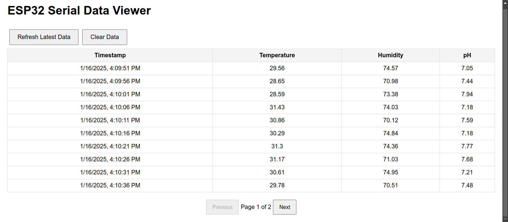

# Screenshot

[vid-1.webm](https://github.com/user-attachments/assets/eba0d6be-6ab2-41df-83c4-1e9e0872af9a)

[vid-2.webm](https://github.com/user-attachments/assets/7b840c3d-c678-41b6-a556-91b8e0381103)
